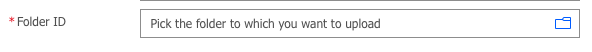
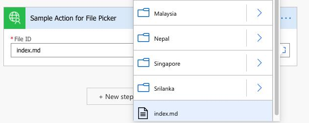
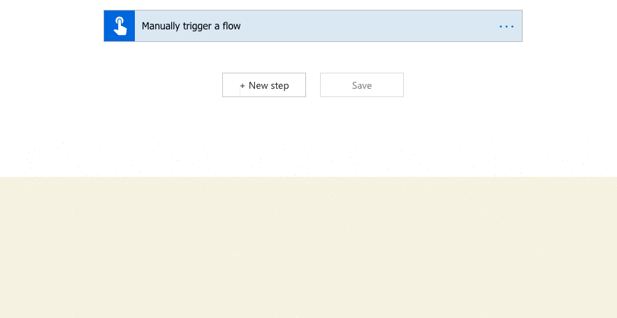

# Power Automate - Custom Connector - File/Folder Picker









Warning : This is a undocumented feature which is not revealed from any official documents. This feature may fail if microsoft decided to pull out. So, Please be careful to use this in Production. This is purely for educational purpose and showcase the power of custom connectors.

This repo contains the sample code on how to add a file/folder picker to a custom connector.

The Sample Action File and Folder Picker uses a dummy non-existing  action endpoint. So, When you run this you will get NOT FOUND. 


**Installation**


Prerequisites for Installing from Terminal
- Install paconn cli in your Local
- Update your tenant environment information in the /file-folder-picker-demo/settings.json file 

To create the connector

```
paconn create --api-prop [Path to apiProperties.json] --api-def [Path to apiDefinition.swagger.json] --icon [Path to icon.png]
```

To update the connector

```
cd file-folder-picker-demo
paconn update -s settings.json
```

#### Note :

1. For Demo Purpose, I have hosted the jsons (2 level depths) to show case the picker tree
2. Please update your base host if needed in the swagger file 

```
"host" : picker-demo.vercel.app
```

